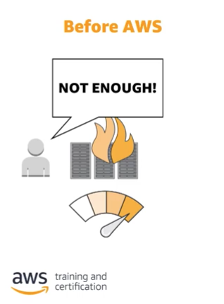
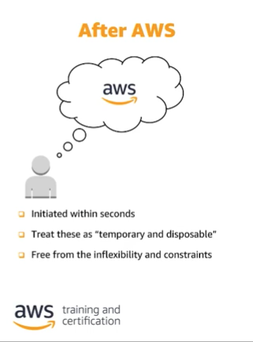
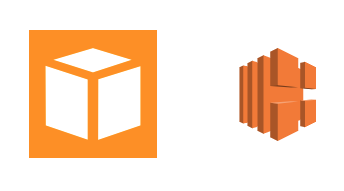
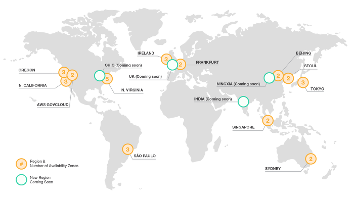
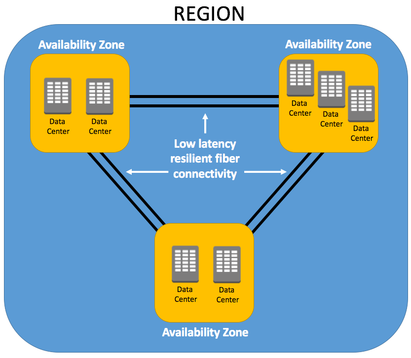

## Cloud Computing

**클라우드 컴퓨팅**은 인터넷을 통해 IT 리소스와 application을 on-demand로 제공하는 서비스이다. AWS 의 경우 요금은 사용한 만큼만 청구된다.

클라우드 컴퓨팅의 등장 이전에는 이론적으로 리소스의 최대 수용량과 **실제로 요구되는 최대 트래픽**(피크)을 예측하여 확보해 놓았는데, 이는 피크가 아닌 경우의 리소스의 유휴 상태로 인한 낭비와 피크 타임의 요구 수용량이 더 클 경우 수요를 충족하지 못하는 문제가 있었다.

AWS를 사용할 경우에는 서버 데이터베이스, 스토리지, apllication 등을 **간편하게 사용**할 수 있으며 **일시적으로 처분 가능한 리소스로 취급**하여 위와 같은 문제를 **피크 타임과 유휴 상태에 따른 유동적인 리소스 할당과 관리**로 해결하였다.

## AWS 의 장점 1 - 향상된 민첩성
기업들이 Cloud computing 으로 마이그레이션 하는 이유는 **향상된 민첩성** 에 있으며 이는 세가지 요소가 있다.
### 1. 속도
AWS 시설은 전 세계에 분포하고 있다. 이는 물리적 거리로 인한 속도의 이점 뿐만 아니라 **막대한 비용을 들이지 않고도 새로운 IT 인프라와 리소스를 사용할 수 있다**는 장점이 있다. 또한 AWS Web console에서 제공하는 UI를 사용하여 **개발자들이 몇 분 안에 리소스를 사용해 볼 수 있어 조직의 민첩성이 상승하는 요인**이 된다.
### 2. 실험
위에 언급된 것과 같이 개발자들이 몇 분 안에 리소스를 사용해 볼 수 있는 특성에서 비롯된 항목이다. AWS를 사용할 경우 서버의 기동과 리소스의 반환, 재사용이 쉽기 떄문에 Cloud 환경에서 코드로서의 운영이 가능하고 안전한 환경에서 실험을 하고 개발을 하며 장애를 대비할 수 있다.

**AWS Cloudformation**을 사용하면 일관적이고 템플릿화된 샌드박스 개발, 테스트 및 프로덕션 환경을 보유하고 운영 제어 수준을 지속적으로 향상 시킬 수 있다.
### 3. 혁신의 문화
AWS는 위와 같이 낮은 위험도와 낮은 비용으로 지속적인 실험이 이루어질 수 있는 환경이다. 빈번한 '실험'을 통해 보다 새로운 구성과 혁신을 탐색할 수 있다.

## AWS 의 장점 2 - 탄력성(Elasticity)
Elasticity는 간편하게 컴퓨팅 리소스의 규모를 확장, 또는 축소할 수 있다는 것을 의미한다. AWS는 필요한 가상 서버가 몇개이건, 몇 시간이 필요하건 필요를 충족하기 위한 탄력적 인프라를 제공한다. 따라서 AWS의 고객은 원하는 속도로 서비스를 사용할 수 있으며 수요의 변화에 맞추어 서비스 소비와 그 에 따른 리소스를 확대, 축하, 조정이 가능하고 새로운 제품이나 방향성을 쉽게 수용할 수 있도록 돕는다.

*AWS 의 Auto Scaling과 Elastic LoadBalancing을 사용하면  어플리케이션의 규모를 확장하거나 수축할 수 있다.*

## AWS 클라우드 인프라의 구성
AWS 클라우드와 인프라는 **리전(region)** 과 **가용 영역(AZ)** 으로 구성되어 있다.

리전이란, 전 세계에 산재한 복수의 AZ를 포함하는 물리적 장소이다. `us-west` , `ap-northeast` 와 같이 특정 지역을 나타내고 있다.

이 리전은 또 다시 **Availability Zone(AZ)** 으로 구성되어 있는데, AZ는 또 다시 여러개의 데이터 센터로 이루어져 있다.

위와 같은 구성은 시스템 구성 요소에 장애가 발생해도 시스템이 작동할 수 있는 상태를 유지하는 **fault tolerance** 을 제공할 수 있게 한다. 또한 이로 인해 시스템이 항상 기능하고 있으며 접속할 수 있고, 시스템 자체의 가동 중지를 최소화하며 사용자가 개입할 필요가 없는 **High-Availability** 를 제공한다.

위와 같은 특성 덕에 AWS의 AZ들은 Application, Database 등을 운영할 수 있는 기능을 제공하며 단일 데이터 센터에서 보다 안정적인 환경이 될 수 있다.

## AWS의 보안
AWS는 Multi Factor Access Control 시스템과 최첨단 전자식 감시 시스템을 사용한다. 또한 사용자가 데이터 리전에 대한 모든 제어권과 소유권을 유지하도록 하는 시스템을 사용하고 있다.

## AWS의 비용 정책
AWS는 리소스를 필요한 만큼만 사용하여 서비스 요금을 그만큼만 지불한다(Pay-as-you-go). 사용한 만큼만 지불하는 요금 정책을 **종량 과금제 모델**이라고 한다.

## AWS의 특성...etc
- AWS 는 자연 재해나 시스템 장애 등의 대부분 장애에서도 시스템을 유지할 수 있는 환경을 제공한다
- AWS의 자산은 프로그래밍 가능한 리소스이므로 이에 대한 보안 정책을 수립하여 포함시킬 수 있다.
- AWS의 안정성은 시스템이 인프라, 서비스 장애를 복구하는 능력으로 정의한다. 또한 수요에 따라 컴퓨팅 리소스를 탄력적으로 확보하고 중단 사태를 완화하는 데에 중점을 둔다.
- 따라서 AWS를 사용하는 것은 하드웨어 수요 예측의 불확실성을 줄이고 향상된 유연성과 용량을 달성할 수 있다.