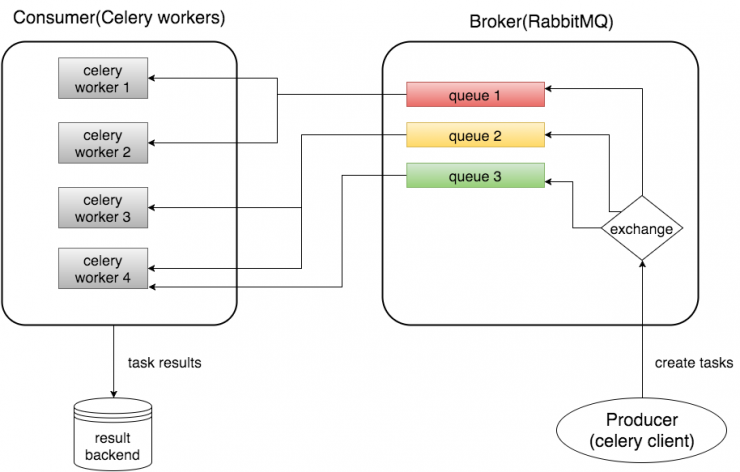

## Celery

python의 celery 라이브러리를 사용하면 *메시지 큐*를 통한 **비동기적 분산 처리**를 할 수 있다. Celery는 동기적 작업을 비동기적 코드로 바꿔줄 수 있으며 Django와 연동하기 쉬운 장점이 있다. 또한 구현에 있어 굉장히 간단하다.

### 동작 메커니즘



Celery는 작업을 `task`라는 단위로 다룬다. 이 `task`들을 여러 스레드 또는 여러 머신에 분산시켜 실행하기 위해 `Task Queue`라는 메커니즘을 활용한다. 

`Producer`가 `task`를 생성해 `Task Queue`를 소유한 `Broker`에게 전달하면 `Broker`는 이 작업을 queue에 *적절한 라우팅*을 통해 할당하고, queue의 `task`를 `worker`에게 전달한다. `Worker`는 전달받은 작업을 실행하는 주체로 작업이 끝난 결과를 어떻게 처리할지까지 담당한다.

## Tutorial 따라해보기

[공식 가이드](https://docs.celeryproject.org/en/latest/getting-started/first-steps-with-celery.html)를 참고하여 celery를 테스트해보기로 했다.

1. 가상환경 설정

Tutorial만의 python 환경을 구성하기 위해 virtualenv를 사용해 가상환경을 설정했다.

```
// virtualenv 설치
$ pip3 install virtualenv virtualenvwrapper

// .venv 이름으로 가상환경 생성, python3.8.2
$ virtualenv --python=3.8.2 .venv

// 가상환경 실행
$ source .venv/bin/activate
```

2. Broker 생성하기

Celery의 `worker`들이 작업을 할당받기 위해 `Task Queue`를 관리할 Broker를 생성해야 한다. 사용할 수 있는 Broker로는 `RabbitMQ`, `AWS SQS`, `redis` 등이 있는데, 가장 간편하게 docker를 통해 띄울 수 있는 `redis`를 선택했다.

```
$ docker run -d -p 6379:6379 redis
```
위 명령어를 통해 docker에 redis container를 생성횄다. 이 컨테이너에 접근할 때는 `redis://localhost:6379`를 사용하면 된다.

3. tasks 생성하기

task는 `worker`들이 처리할 작업을 의미한다. `worker`들이 할당받을 작업을 정의해 주어야 한다.

```python
# tasks.py
from celery import Celery

# Celery를 사용해 tasks로 정의, broker를 지정해 app 생성
app = Celery('tasks', broker='redis://localhost:6379')

# 위에서 정의한 app의 task
@app.task
def add(x, y):
    return x + y
```

4. worker server 시작하기

위에서 정의한 app의 task를 처리하는 worker를 시작해야 위의 task가 queue에 들어왔을 때 처리할 수 있다.

```
// celery -A [task가 정의된 app이 있는 py 파일] worker --loglevel=info
$ celery -A tasks worker --loglevel=info
```

5. task 호출해 사용하기

파일을 작성해서 사용할 수도 있지만, tutorial에서는 python3를 직접 실행해 사용했다.

```
$ python3

>>> from tasks import add
>>> add.delay(8, 8)
<AsyncResult: c5175309-b9a3-4dc2-b600-b159aa95bbc8>
```

`delay()`는 `apply_async()`의 star argument(*args, **kwargs) 버전이다. `apply_async`는 message를 보내면서 task를 비동기적으로 실행하도록 하는 함수인데, `delay()`를 사용하면 shortcut 느낌으로 사용할 수 있다고 한다.

`delay()`를 사용한 결과는 `AsyncResult` instance를 return하는데, task의 상태를 확인하는데 사용할 수 있다. 

결과값은 기본적으로는 사용할 수 없는 상태라서 이 결과값들을 저장하기 위해서는 Celery에 result backend를 사용할 수 있도록 설정해주어야 한다.

6. result backend 설정하기

result를 저장할 backend는 여러 옵션을 선택할 수 있지만 tutorial에서는 *rpc*를 지정해 사용한다. 난 docker container를 하나 더만드는게 편했기 때문에 아래와 같이 5001번 포트로 redis container를 새로 만들어 지정해 주었다.

```
docker run -d -p 5001:6379 redis
```

backend가 준비되면 `tasks.py`에서 정의한 `app`에 `backend`를 설정해주면 된다

```python
# tasks.py
from celery import Celery

# Celery를 사용해 tasks로 정의, broker를 지정해 app 생성
app = Celery('tasks', backend='redis://localhost:5001', broker='redis://localhost:6379')

# 위에서 정의한 app의 task
@app.task
def add(x, y):
    return x + y

```

방금처럼 python3를 직접 실행해 결과값을 받아보자

```
>>> from tasks import add
>>> result = add.delay(4, 4)
>>> result.ready()
True
>>> result.get()
8
>>> 
```

`result.ready()`는 해당 `task`가 준비된 상태인지를 반환하며 `result.get()`을 사용하면 준비된 `task`의 결과값을 받아온다.

## 후기

멀티 스레드가 GIL 때문에 복잡하게 느껴지는 탓에 멀티스레드를 잘 사용하지 않았는데, celery는 이 멀티 스레드 방식을 비동기적 분산 처리로 대체할 수 있는 아주 중요한 방식인 것 같다. 분산 처리가 가능하기 떄문에 수평적 확장을 할 수 있는 것도 큰 이점이라고 생각한다. django와의 연동도 굉장히 편리하고 잘 되어있다고 하니 django도 연동해서 사용해봐야겠다.