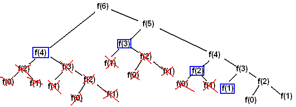

## Dynamic Programming 이란?

특정 조건의 값을 구하기 위해 다른 조건의 값까지 이용하여 효율적으로 값을 구하는 알고리즘 기법이다. 구체적인 알고리즘이라고 이해하기 보다는 이미 구한 답을 재활용하여 문제를 최적화하거나 큰 문제를 작은 문제의 집합으로 해결하는 방식 등을 총칭한다.

## 접근 방식

divide and conquer 방식과 비슷하지만 divide and conquer가 큰 문제들을 작은 문제로 나누어 해결하는 방식인 반면에 dynamic programming은 작은 문제들을 여러번 반복해 풀어야 하는 경우에 사용할 수 있다. 간단하게 이미 풀었던 문제의 해를 저장해두었다가 다시 사용하는 것이라고 생각하면 될 것.

## Memoization

dynamic programming 을 조사하면 메모이제이션이라는 단어가 굉장히 많이 등장한다. 위에 언급했던 `작은 문제의 해를 저장해두었다가 다시 사용하는 것`을 말한다.

## 대표적인 예시 - 피보나치 수열

```python
# x번째 피보나치 수열 구하기
def fibonacci(x):
  if x == 0 or x == 1:
    return 1
  return fibonacci(x - 1) + fibonacci(x - 2)
```

위와 같이 코드를 작성하면 해는 정상적으로 출력되지만, recursive하게 짜여있어 함수의 call stack이 지속적으로 쌓이게 되고, 이것들이 메모리 공간을 차지하게 된다.



또한 위의 그림처럼 6번째 피보나치 수열을 계산하기 위해서는 4, 5번째 피보나치 수열을 더하면 되는데, 이를 얻기 위해 중복 계산되는 횟수가 매우 크며, x가 1 늘어날 떄마다 이 수는 기하급수적으로 늘어난다.

따라서 필요한 값들을 기억해두고 사용하는 메모이제이션을 토대로 코드를 다시 작성했다.

```python
# memo로 가장 최근의 2개 결과값을 저장
memo = [1, 1]

def fibonacci_memo(memo, x):
  # 0, 1번째는 1이므로 바로 return
  if x < 2: 
    return memo[1]
  
  # memo를 업데이트(가장 최근 2개로)하여 다시 fibonacci_memo 실행
  return fibonacci_memo([memo[1], memo[0] + memo[1]], x - 1)
```

위와 같이 memo로 전부 다 기억해 메모리를 잡힐 필요 없이 최근 2개만 기억해두고 사용하는 코드를 작성했다.

## 정리
1. 작은 문제를 조사하다 보면 일정한 규칙을 발견할 수 있을 것이다
2. 작은 문제들을 이용해 점화식을 도출할 수 있을 것이다
3. 위의 문제들의 해답이 항상 같고 여러번 반복되는 경우에는 메모이제이션을 사용해보자