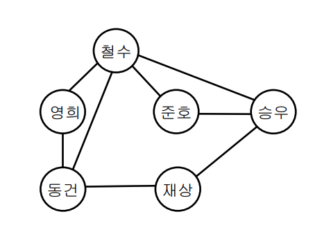
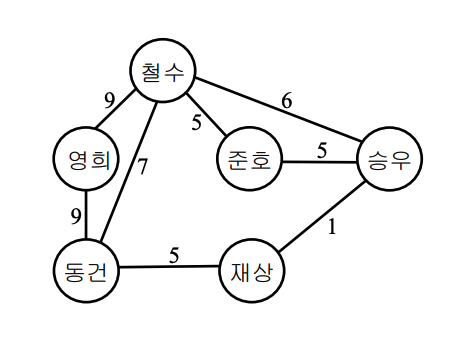
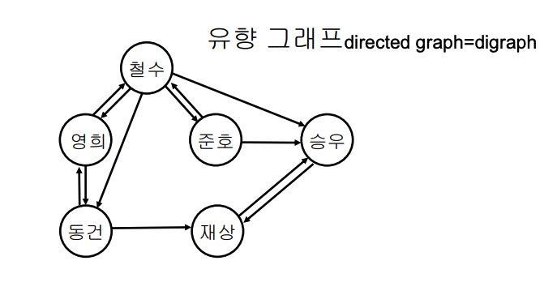
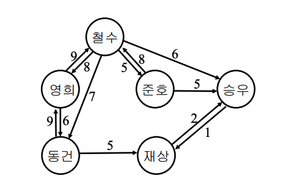

## Graph 는 무엇인가?

Graph는 현상이나 사물을 정점(Vertex)와 간선(Edge, 연결된 정점 정보)로 표현한 것이다. Graph의 정보를 표현할 떄는 `G=(V,E)`로 V에 *정점 집합*을, E에 *간선*집합을 표현한다. 두 정점이 간선으로 연결되어 있으면 *인접(adjacent)*하다고 표현한다.

### Graph의 종류

참고 - [한빛아카데미 강의노트](http://nlp.chonbuk.ac.kr/AL/ch09.pdf)

**그래프**

**가중치 그래프**

**유향 그래프**

**유향 가중치 그래프**

## 그래프의 탐색 방법과 인접 행렬, 인접 리스트
[이전 포스팅](https://veatoriche.netlify.app/algorithm/dfsbfs/) 참조

## Minimum Spanning Trees

무향 연결 그래프에서 cycle 없이 그래프 G의 모든 노드를 최소한으로 연결하는 Tree
- 연결 그래프 : 모든 정점간에 경로가 존재하는 그래프
- Cycle : 계속 진행하면 다시 자기 자신으로 돌아오는 경로가 있는 간선 집합
- 최소 신장 트리 : 그래프의 정점과 간선으로 구성된 트리 중 간선의 합이 최소인 트리

-> 무향 연결 그래프 G의 최소 신장 트리를 minimum spanning tree 라고 한다.

### Minimum Spanning Tree를 구하는 알고리즘
**Prim Algorithm**

대표적인 최소 신장 트리 알고리즘으로, 시작 정점을 선택하고 정점에 인접한 간선 중 최소 간선으로 연결된 정점을 선택하고 이를 반복하며 트리를 확장해 나가는 알고리즘이다. Greedy algorithm을 기초로 하고 있다.

**수행 과정**

1. 시작할 정점을 선택한다. - `선택한 정점 리스트`에 추가한다.
2. 선택한 정점에 연결된 모든 간선을 `간선 리스트`에 추가한다.
3. `간선 리스트`를 간선의 가중치로 오름차순 정렬한다.
4. 간선을 하나씩 탐색해 연결된 정점이 `선택한 정점리스트`에 없을 경우 추가한다.
5. 탐색한 간선을 리스트에서 제거한다.
6. 간선 리스트가 빌 때까지 2~5번을 반복한다.

**Kruskal Algorithm**

Prim Algorithm이 노드를 선택하면서 노드에 연결된 간선을 비교하는 알고리즘이라면, Kruskal Algorithm은 가장 작은 간선을 선택하면서 cycle이 생기지 않는 선택지를 골라가며 MST를 완성하는 알고리즘이다.

**수행 과정**

1. 모든 간선을 가중치를 기준으로 오름차순 정렬한다
2. cycle이 생기지 않게 간선을 `선택한 간선 리스트`에 포함시킨다
3. 2번의 과정을 모든 간선에 대해 반복한다.