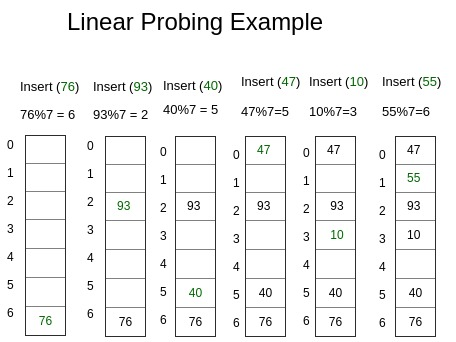

## Hash란 무엇인가?
해시의 기본적인 개념은 Key를 이용해여 Value를 저장하는 것이다.

해시에서 사용하는 Key의 값을 *해시 함수*에 사용하여 이를 통해 나온 **결과값**을 배열의 인덱스로 사용한다. 이 결과값은 연속된 값이 아니며 hash function의 정확도에 따라 hash table에 저장되는 value의 위치가 같아 충돌하는 현상인 **collision**의 빈도가 결정된다.

## Hash를 사용하는 이유
해시와 비슷한 자료 구조인 배열은 데이터를 한번에 연속적으로 저장하는데, index를 알고 있으면 원하는 데이터에 바로 찾아갈 수 있어 시간 복잡도는 O(1)이라고 볼 수 있다.

하지만 배열에서 데이터를 삭제하거나 삽입하는 과정은 조금 복잡한데, 임의의 위치의 데이터를 삭제, 삽입할 경우 나머지 데이터를 shift하는 과정이 필요하므로 시간 복잡도는 O(n)이 된다.

반면에 해시를 사용할 경우 hash function에 key값을 넣어 나온 결과값을 사용해 hash table에 저장하기 떄문에 삽입과 삭제 연산을 진행할 때 데이터가 메모리에서 연속할 필요가 없으므로 삭제, 삽입 연산에서 shift할 필요가 없다. 

따라서 Hash를 사용할 때에는 저장된 데이터들을 삭제하거나 삽입하는 빈도가 큰 경우에 사용하는 것이 좋다.

## Hash 사용중 발생할 수 있는 문제들

### Hash Collision
Hash를 사용할 때에는 `{Hash Function 결과값 : Value}`를 저장하는 공간인 **Hash Table** 이 필요한데, 이 Table은 크기가 유한하고 Hash Function의 결과값이 동일한 *Hash Collision*이 발생할 가능성이 존재한다.

### Overflow
Hash collision이 Hash table의 최대 크기를 넘게 발생하여 Hash table의 크기를 넘어 저장하게 되는 현상이다. 예를 들면, 최대 크기가 2인 hash function에서 동일한 hash function 결과가 3개 발생할 경우, overflow가 발생한다.

### Clustering
Hash Table에 저장된 데이터가 연속적으로 몰리는 현상이다.

## Hash Collision 대처 방법

### Seperate Chaining (Open Hashing)

Hash Table을 Linked List와 같이 새로운 공간을 할당하여 구성하는 방식으로, JDK ,C++ 내부에서 사용한다. 위와 같이 새로운 공간을 할당하는 특성 때문에 Open Hashing 이라고도 한다.

### Open Addressing (Closed Hashing)

collision이 일어나면 지정된 규칙에 따라 다음 저장 위치를 결정하는 방식이다. 지정된 해시 테이블 내에서만 저장이 되기 떄문에 Closed Hashing 이라고 한다. 

Open Addressing에서 다음 저장 위치를 결정하는 방식은 아래와 같다.

**Linear Probing - 선형 조사**

충돌이 일어난 다음 자리에 저장하는 방법이다. 위의 예시와 같이 Hash Function이 `key % 7` 인 경우, 위와 같은 collision이 발생할 수 있다. 선형 조사 방식은 Hash Function의 결과값 위치에 이미 자료가 저장되어 있을 경우 바로 다음 위치를 조사하며 비어있는 공간을 찾는 방식이다.

하지만 위와 같은 방식으로 collision을 처리할 경우에는 데이터가 저장된 위치가 몰리게 되는 primary clustering이 발생할 수 있다.

수식으로 표현하면 위에서 설명한 것과 같이 저장 위치를 i 씩 증가시키며 테이블의 최대 길이를 벗어나지 않게 mod 연산을 취하는 것이다.

**Quadratic Probing (2차 검색법)**

충돌이 발생한 경우 다음 자료의 위치를 위와 같은 수식으로 결정하는 방식이다. `c1 = c2 = 1` 인 경우, 자료의 저장 위치는 `h(k), h(k) + 2, h(k) + 6 ... ` 이 되는 것이다.

hash table의 크기가 2^n 일 경우, `c1 = c2 = 1/2` 로 지정하는 것이 좋다고 한다.

위와 같은 경우에는 Secondary Clustering이라는 여러개의 데이터가 동일한 초기 해시 함수값을 갖는 현상에 취약한데, 이 경우에는 반드시 위와 같은 수식을 한번 더 거쳐야 하기 떄문이다. 따라서 초기 해시값이 겹치지 않도록 hash function을 잘 구성하는 것이 중요하다. 

**Double Hashing (이중 해싱)**

위와 같이 hash function을 두 개(h(x), f(x)) 설정하여 위치를 결정하는 방식이다.

## Hash Table의 검색 시간

Load factor 라는 개념이 있는데, Hash table에서 얼마나 원소가 차있는지를 나타내는 수치이다. 이 값은 `a = n(저장된 원소)/m(테이블 크기)` 으로 결정되는데, hash table에서의 검색 효율은 load factor와 연관된다.

일반적으로 load factor가 높아지면 hash table의 효율이 떨어진다. 따라서 미리 임계값을 설정해놓고 load factor가 임계값 이상이 되면 hash table의 크기를 늘리는 것이 좋다.

### Seperate Chaining에서 검색 시간

- load factor가 `a` 일 때 검색에 실패할 기대값은 a 이다
- load factor가 `a` 일 때 검색에 성공할 기대값은 1 + a/2 + a/2n 이다.

### Open Addressing에서 검색 시간

- 기본적인 가정이 필요한데, 검색 순서인 hash function의 결과값(h0(x), h1(x) ... h_m-1(x)) 가 순열을 이루고 모든 값이 발생할 확률이 일정하다고 가정하자.
- 위와 같은 상황에서 load factor 가 `a` 일 때 검색에 실패하는 횟수의 기대값은 1/(1-a)이다.
- load factor가 `a` 일 때 검색에 성공하는 횟수의 기대값은 (1/a)log(1/(1-a)) 이다.

