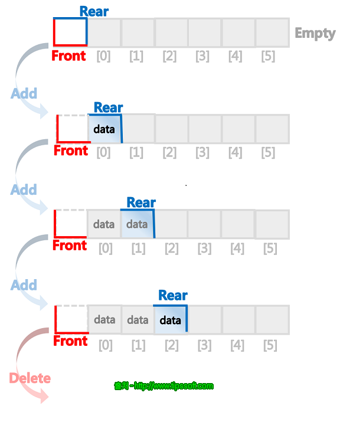

## Stack

- 한쪽 끝에서만 자료의 삽입과 삭제가 가능한 형식의 자료 구조
- LIFO (Last In First Out)
- 가장 나중에 삽입된 항목이 가장 먼저 제거된다.
- Stack에서 추상적으로 가장 상위에 있는 지점, 논리적으로는 삽입과 삭제가 일어나는 지점을 `top` 이라고 한다.

### Stack의 function

가장 기본적인 연산은 pop과 push이다.
- pop()
  - Stack의 top에 위치한 항목을 제거한다.
- push(item)
  - Stack의 top + 1에 데이터를 추가하고 top을 해당 위치로 옮긴다.

이외에 흔하게 사용되는 function은 peek, isEmpty 정도가 있다.
- peek()
  - top에 위치한 항목의 값을 반환한다.
- isEmpty()
  - Stack이 비어있는지 True, False를 반환한다.

### 어디에 사용할 수 있나?

- call stack
  - 컴퓨터 프로그램에서 현재 실행중인 subroutine에 대한 정보를 저장하는 자료 구조
  - 실행중인 작업이 있는 상태에서 subroutine을 실행해야 하는 경우에 call stack에 현재의 제어 정보를 저장하고 subroutine이 끝났을 때 stack에 저장된 제어 정보를 사용하여 이후 돌아가야 할 위치를 결정한다.
  - 위와 같은 개념을 function call stack 과 같이 함수 안에서 함수를 call 할 때에도 사용하여 함수가 끝날 때 마다 원래 위치로 돌아갈 곳을 저장한다.
  - 현재 상태를 저장할 필요가 있는 모든 곳에 사용할 수 있을 것이다
    - 뒤로가기
    - 실행 취소
    - IDE의 괄호 매칭 등
- DFS (Depth-First-Search)

## Queue

- 먼저 넣은 데이터가 먼저 나오는 형식의 자료구조
- FIFO (First In First Out)
- 음식점 대기열
- 데이터가 입력된 시간 순서대로 처리해야 하는 상황에 이용한다.
- Queue에서 추상적으로는 가장 앞, 논리적으로는 자료가 삭제되는 부분을 `front` 라고 한다.
- Queue에서 추상적으로는 가장 뒤, 논리적으로는 자료가 삽입되는 부분을 `rear` 라고 한다.

### Queue의 Function

Queue에서도 Stack과 마찬가지로 데이터의 삽입, 삭제가 가장 기본이 된다.
- enqueue(item)
  - Queue의 rear + 1의 위치에 데이터를 삽입하는 함수.
- dequeue()
  - Queue의 front에 위치한 데이터를 삭제하는 함수.

이외에도 사용하는 함수로는 isEmpty 등이 있다.

### Queue의 구현

Queue는 Stack과 마찬가지로 배열로 구현할 수 있겠지만, 데이터의 삭제가 일어나면 Queue의 모든 원소를 한칸 당겨주거나 배열의 0번째 위치를 front로 옮겨야 하기 떄문에 시간 효율성 측면에서 overhead가 발생할 수 있다. 따라서 linked list를 이용한다면 삽입과 삭제시에 원소를 이동시킬 필요가 없을 것이다.

### Queue의 종류

**선형 큐**

- 기본적인 큐의 형태
- 배열로 선얼할 시, 삭제와 생성이 일어났을 때 크기가 제한되어 있어 빈 공간을 사용하려면 모든 자료를 꺼내거나 한칸씩 queue를 모두 옮겨야 한다.

**원형 큐**

- 선형 큐의 제한된 크기에서 나타나는 문제점을 보완하기 위해 등장
- front가 queue의 끝에 닿으면 맨 앞으로 자료를 보내 원형으로 연결하는 방식

**우선순위 큐**

- 데이터의 우선순위에 따라 우선순위가 높은 데이터부터 꺼내도록 만들어진 큐
- 데이터를 삽입할 때 우선순위에 따라 정렬하여 삽입하면 된다.
- 우선순위 큐를 구현할 때에는 보통 Heap을 사용하여 구현하는 것이 일반적이다
  - 배열로 구현했을 시에는 선형 Queue와 같은 문제점이 나타날 수 있다.
  - linked list로 구현할 경우 우선순위를 따져 정렬하는 과정에서 모든 node를 탐색해 우선순위를 비교해야 하는 문제점이 생긴다.
- Heap
  - 최소값, 최대값을 찾는 연산을 빠르게 하기 위해 고안된 완전 이진 트리

### 어디에 사용할 수 있나?

- 위에 언급한 바와 같이 시간 순서대로 요청을 처리하기 위한 모든 곳에 사용할 수 있다.
- BFS (Breadth-First Search)