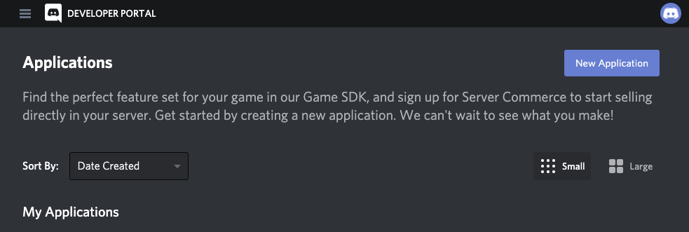
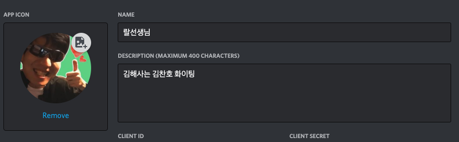
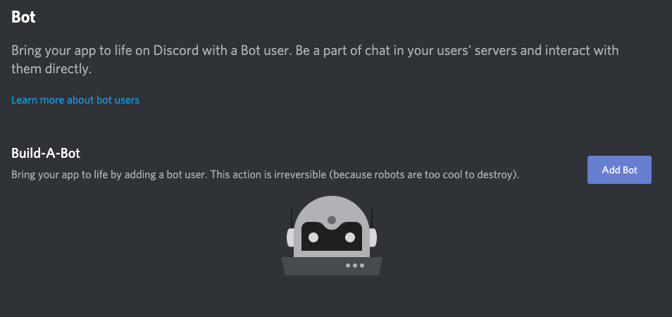
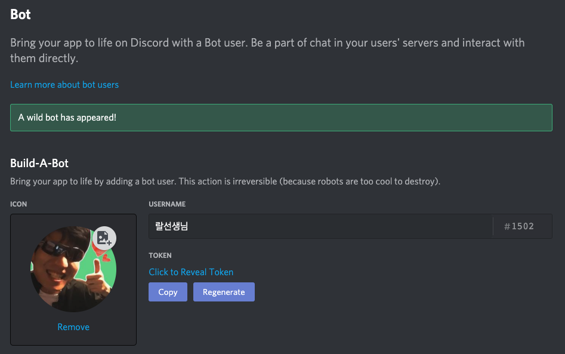
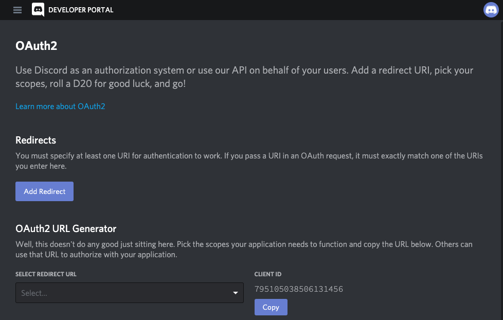
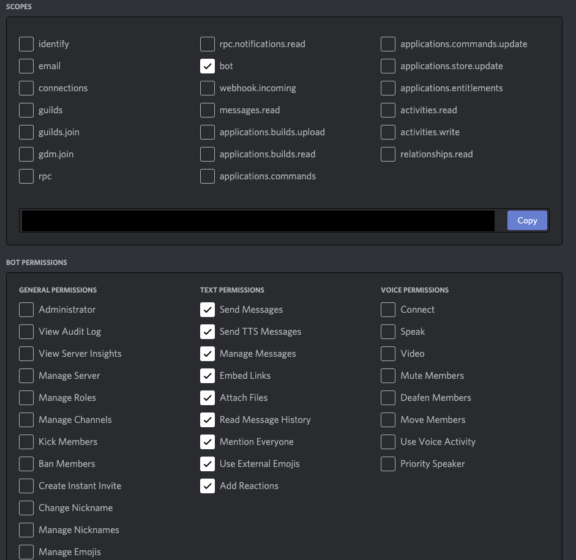
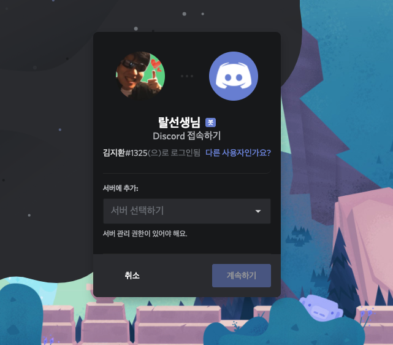

[*프로젝트 저장소*](https://github.com/veatoriche/ralobot)

[*ralobot 초대 주소*](https://discord.com/api/oauth2/authorize?client_id=795105038506131456&permissions=522304&scope=bot)

## 개요

- 디스코드 api를 둘러보던 도중 좋아하는 방송인의 유투브 새로운 영상을 친구들과 함께 시청하면 좋겠다는 생각이 듦.

## 목표

- 방송인 한명의 유투브 알림 기능과 리액션을 만들기
- 이번에 진행하는 프로젝트를 일반화 시켜 youtube 알림 봇 개발해보기

**세부 목표**
1. 입장시 인사 메세지 구현
2. 재미 위주의 명령어와 그에 따른 리액션 추가
3. 유투브 api와 연동하여 동영상 link하는 기능 추가
4. 비트코인 api 조사 후 떡락 떡상 리액션 추가

## 구현 시작

디스코드 봇을 만들기 위해서는 application을 만든 후 bot을 추가하는 과정이 필요하다. 아래부터는 [디스코드 개발자 페이지](https://discord.com/developers/application)에서 진행하면 된다.

### Application 등록과 Bot 생성

개발자 페이지에 로그인한 후에 `new application`을 눌러 새로운 어플리케이션을 만들어준다. 

어플리케이션을 만든 후에는 application을 Bot으로 등록하면 된다. 좌측의 bot 메뉴를 누른 후에 위에 보이는 화면에서 `Add bot` 을 눌러 bot을 등록해주자

봇을 등록하면 위와 같은 화면이 될 것이다.

### Bot을 서버에 등록하는 url 만들기

Bot을 서버에 초대할 때에는 OAuth2 인증방식을 이용한 url을 생성하고 이 url에 접속하면 된다. OAuth2 URL을 만드려면 Bot이 사용하는 권한을 하단에서 선택해야 한다.

Scopes에서 `bot`을 선택하면 하단에 `Bot permissions`가 나타나는데, 이번에 만들 봇에서는 text에 관련된 권한만 필요할 것으로 예상되니 text에 관련된 permission만 선택했다. 이후 Scopes 하단의 url을 복사해 연결하면 된다.

위와 같은 화면이 나오면 성공이다.