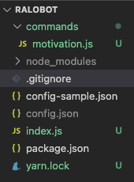
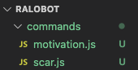

[*프로젝트 저장소*](https://github.com/veatoriche/ralobot)

[*ralobot 초대 주소*](https://discord.com/api/oauth2/authorize?client_id=795105038506131456&permissions=522304&scope=bot)

## Discord.js
[Discord.js](https://discord.js.org/#/)는 node를 사용해 discord api를 쉽게 사용할 수 있는 모듈이다. [Discord API](https://discord.com/developers/docs/intro) 에 명시된 API들을 보다 쉽게 사용할 수 있도록 한번 더 가공한 모듈이라고 보면 될 것 같다.

이번에 만드는 봇은 굳이 어려운 길을 선택할 이유가 없어 discord.js로 가볍게 구현해보려 한다.

## 프로젝트 구성



프로젝트는 위와 같이 구성할 예정이다. commands 폴더 안에 적절한 이름으로 목적을 나누어 함수를 작성하고 export하여 `index.js`에서 사용하는 간단한 구조가 될 것이다.

`config-sample.json`은 간단한 json 파일로 github 저장소에 업로드할 때 bot의 인증 토큰이 유출되는 것을 막기 위해 작성했고 `config.json`은 gitignore에 등록했다.

## 구현

### 에시 코드 실행

```javascript
const Discord = require('discord.js');
const client = new Discord.Client();

client.on('ready', () => {
  console.log(`Logged in as ${client.user.tag}!`);
});

client.on('message', msg => {
  if (msg.content === 'ping') {
    msg.reply('Pong!');
  }
});

client.login('token');
```

위는 가장 대표적인 discord.js 예시인데, 이 script를 `node index.js` 로 실행하면 token을 사용해 봇이 온라인 상태로 바뀌며 `message, guildMemberAdd ,,,` 등ㅇ의 이벤트를 기다리는 상태가 된다. `eventlistener`나 `webSocket`과 흡사하다고 느껴졌다.

```
$ node index.js 
Logged in as 랄선생님#1502!
```


실행하면 위와 같이 로그인 되고 discord에는 온라인으로 표시된다.

### 간단한 명령어 받아보기

명령어를 받을 때는 [공식 가이드](https://discordjs.guide/command-handling/#individual-command-files)에 적혀있는 것과 같이 별도의 폴더를 만들고 그 안에 개별적인 파일로 command 함수를 만들어 관리하는 방법을 사용할 것이다. 

```javascript
// commands/motivation.js
module.exports = {
	name: '동기부여',
	description: '랄로 동기부여 영상',
	execute(msg, args) {
		msg.channel.send('https://www.youtube.com/watch?v=btfuIz3qrSE');
	},
};
```

```javascript
// index.js
const Discord = require('discord.js');
const fs = require('fs');

const {token, prefix} = require("./config.json");
const commandFiles = fs.readdirSync('./commands').filter(file => file.endsWith('.js'));

const client = new Discord.Client();
client.commands = new Discord.Collection();

// commands안의 모든 파일을 command로 등록
for (const file of commandFiles) {
	const command = require(`./commands/${file}`);
	client.commands.set(command.name, command);
}

client.on('ready', () => {
  console.log(`Logged in as ${client.user.tag}!`);
});

client.on('message', msg => {
  // 작성자가 봇이거나 prefix가 붙지 않은 명령어 무시
  if (!msg.content.startsWith(prefix) || msg.author.bot) return;

  const args = msg.content.split(' ');
  const command = args[1];
  // 명령어에 붙은 args가 2개 이상이면 message 전달 후 무시
  if (args.length !== 2) {
    msg.reply('1개만 붙여라');
    return;
  }

  try {
    client.commands.get(command).execute(msg, '');
  } catch (error) {
    console.log(error)
    msg.reply('네 해드렸습니다.');
  }
});

client.login(tokenㅇ);
```

위처럼 코드를 작성하면 commands 디렉토리 안의 모든 명령어를 `name`으로 호출할 수 있게 등록되고 `[prefix] [command name]`으로 사용할 수 있다. 위의 예시는 `!랄로 동기부여`로 사용할 수 있는 예시다.


`node index.js`로 실행한 후 `!랄로 동기부여`를 타이핑하면 위와 같이 작동하는 것을 볼 수 있다.



위의 방법을 사용하면 하나의 command당 1개의 파일로 작성해 Command가 너무 길어지더라도 관리하기 수월한 구조가 될 것이다. 오늘은 재미삼아 여러 명령어들을 추가해보고 다음에 youtube api를 사용해 자동으로 알림 메세지를 보내는 기능을 추가해보자.

