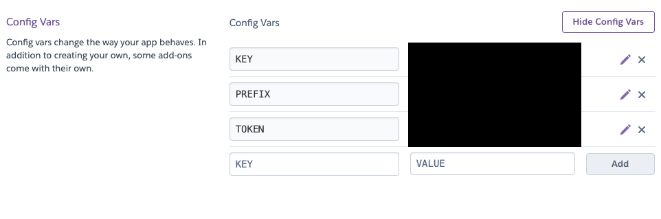

## heroku란?

heroku는 대표적인 무료 호스팅 서비스로, project의 환경을 자동으로 감지하여 이에 맞는 환경을 자동으로 생성해주고 지정된 command를 통해 프로그램을 실행할 수 있는 서버를 호스팅해준다. aws에 비해 비용도 많이 절감되고 간편하다고 할 수 있지만 호스팅되어있는 서비스에 일정 시간동안 요청이 없을 경우에는 휴면 상태에 들어가 응답이 늦어지는 단점이 있다.

이번 프로젝트는 돈을 받고 제공하는 서비스도 아닌 관계로 비용을 투자하고 싶지 않아서 heroku에 간단히 올려보려고 한다.

## 준비 작업

### 중요한 정보 환경 변수로 빼내기

지금까지 진행한 프로젝트에서는 중요한 key값들을 `config.json`이라는 파일에 저장해 두었는데, heroku는 github에 업로드된 프로젝트를 clone 받아 실행하는 관계로 `config.json`파일이 존재하지 않아 프로젝트가 제대로 동작하지 않을 것이다.

따라서 `config.json`의 값들을 환경 변수로 바꾸어 호스팅된 환경에서 `config.json`파일 없이 환경 변수를 추가로 등록해 프로젝트가 정상 동작하도록 변경해야 한다. 이를 위해 `dotenv`라는 라이브러리를 활용할 것이다.

```
# npm
$ npm install dotenv

# yarn
$ yarn add dotenv
```

위 명령어로 dotenv를 설치한 후 다음과 같이 사용하자

```js
// -------------------------------------------------
// .env파일
TOKEN=[token 내용]
KEY=[key 내용]
...
// -------------------------------------------------

// -------------------------------------------------
// index.js
// dotenv 로드 후 config()로 project root에 있는 .env파일을 환경변수로 로드
require('dotenv').config();

// 환경 변수 사용
token = process.env.TOKEN
```

위와 같이 환경변수로서 중요한 정보들을 관리할 수 있다.

### Heroku 세팅하기

Heroku에 내 저장소를 지정한 후에 설정하는 작업이 필요하다. 우선 project의 root에 `Procfile`이란 파일을 생성하자.
```
//<process type>: <command>
worker: node index.js
```
`Procfile`의 내용에 `worker`로 프로젝트를 실행하는 command를 등록해주면 heroku 관리 페이지에서 해당하는 command로 서비스를 시작하게 설정할 수 있다.

이제 [herkou 대시보드](https://dashboard.heroku.com/)에 접속하자.


좌측 상단의 new에서 Create new app을 선택해 새로운 앱을 등록하자


Application의 이름을 입력하고 next를 눌러 진행하자 region은 us와 europe밖에 없다.


Application이 만들어진 후에 자동으로 해당 app의 deploy메뉴로 이동하게 되는데, 여기서 붉은 박스로 표시된 GitHub를 클릭하면 하단에 Repository를 선택할 수 있게 된다. 적절한 repository를 선택해주자


저장소를 선택한 후에는 위와 같은 화면이 된다. automatic deploy를 선택하면 선택된 branch에 새로운 commit이 추가될 때 마다 서비스를 자동으로 update해준다. 하단의 deploy branch 버튼을 누르면 수동으로도 환경을 갱신할 수 있다.


Resources로 이동하면 위와 같은 화면이 등장하는데, 서비스를 시작할 떄 기본적으로는 `npm start`(node 기반일 경우)라는 command로 설정되어 있을 것이다. 만약 `Procfile`이 정상적으로 등록되어있다면 바로 밑에 `worker node index.js`라는 명령어가 추가되어 있을 것이다. 우측의 펜 버튼을 눌러 사용할 command를 켜주자.



이후에 Settings 탭으로 이동해 ConfigVars에 환경변수를 전부 등록해주면 `process.env`로 등록된 환경변수에 접근할 수 있게 된다.


설정이 완료되고 나서 수동으로 deploy를 해주었다.

### deploy를 완료해도 봇이 동작하지 않을 경우

이 경우에는 worker로 등록한 `node index.js`등의 명령어가 제대로 동작하지 않는 것이다. 등록한 명령어가 작동하지 않으면 명령어 실행 중 어떤 문제가 있는지 확인하기 위해 서버에서 직접 console 명령어를 입력해보는 것도 방법이 될 수 있다.


App 대시보드의 좌측 상단 More 메뉴의 `Run Console` 메뉴를 클릭하면 명령어를 하나씩 사용하고 결과를 가져올 수 있다. 


working directory는 project의 root에 설정되어 있으므로 명령어를 실행해보고 어떤 에러가 발생하는지 확인해볼 수 있다.

만약 이래도 봇이 자동으로 실행되지 않는다면 manual deploy를 눌러보자.

최후의 수단으로는 기본적으로 지정된 `npm start`를 이용하는 것이다. project의 package.json에 다음과 같은 라인을 추가하자

```json
"scripts" : {
  "start": "node index.js"
}
```

내 경우에는 `worker : node index.js`가 작동하지 않아 위와 같이 `npm start`로 명령어를 지정한 뒤 heroku에서 기본 지정되어있는 `npm start`로 dyno를 설정하였더니 잘 동작하였다.