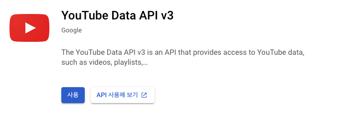
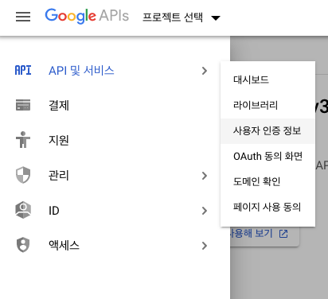
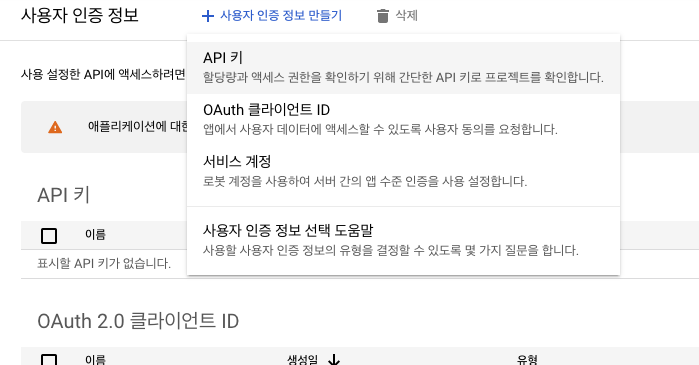
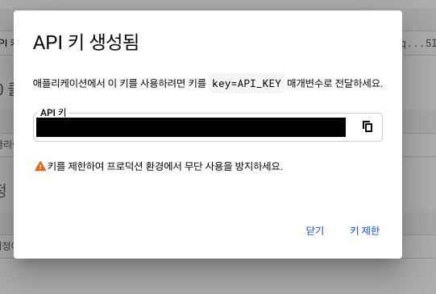
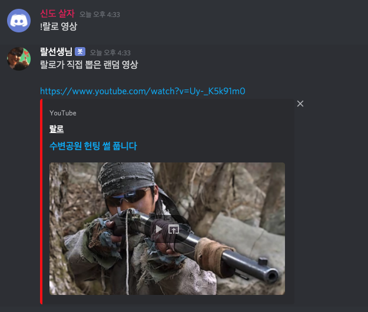

## Youtube API 사용 시작하기

Youtube API를 사용하면 채널 정보, 영상 조회 등의 작업을 간편하게 진행할 수 있다. 물론 api를 무제한으로 사용할 수 있는 것은 아니고, 하루에 지정된 할당량만큼만 사용할 수 있다. 사용량 계산은 [여기서](https://developers.google.com/youtube/v3/determine_quota_cost) 확인할 수 있다. 



Youtube API를 사용하려면 API Key를 생성해야 한다. 우선 [구글 API 사이트](https://console.developers.google.com/apis/library/youtube.googleapis.com?q=youtube)에 접속해 사용 버튼을 눌러주자





이후 좌측 탭에서 사용자 인증 정보 메뉴를 선택한 후에 사용자 인증 정보 만들기 버튼에서 api 키를 선택하여 api키를 생성해보자



Key가 성공적으로 생산되었다. 앞으로 api에 요청을 할 때 매개변수로 이 값을 넣어주어야 api가 정상적으로 동작한다.

## Youtube API 사용해보기

[공식 가이드 문서](https://developers.google.com/youtube/v3/docs)를 참고하여 진행해보자. 디스코드 봇에 적용하려는 기능은 유투브 api를 연동하여 랜덤한 영상 링크를 응답하는 기능이다. 

이를 위해서는 youtube api의 [playlistItem의 list](https://developers.google.com/youtube/v3/docs/playlistItems/list)를 이용해 uploads playlist 즉, 업로드한 모든 영상을 뜻하는 플레이리스트에 대한 video list를 받아와 랜덤하게 선택하면 될 것 같다. 또한 node 환경에서 API에 HTTP 요청을 보내기 위해 http 모듈을 사용하는 것이 좋겠다.

```javascript
const http = require('request-promise')
const config = require('../config.json')

const options = {
  url: "https://www.googleapis.com/youtube/v3/playlistItems",
  method: 'GET',
  qs: {
    key: config.key,
    playlistId: 'UUD2YO_A_PVMgMDN9jpRrpVA',
    maxResults: 50,
    part: 'contentDetails'
  }
};  

function randomChoice(arr) {
  return arr[Math.floor(Math.random() * arr.length)];
}

module.exports = {
	name: '영상',
	description: '최근 50개의 영상 중 랜덤한 랄로 영상 링크를 받습니다.',
	async execute(msg, args) {
    try {
      const result = await http.get(options);
      const randomVideo = randomChoice(JSON.parse(result).items);

      messageBody = "랄로가 직접 뽑은 랜덤 영상\n\n";
      messageBody += "https://www.youtube.com/watch?v=" + randomVideo.contentDetails.videoId;
      msg.channel.send(messageBody);
    } catch (e) {
      console.log(e);
    }
	},
};
```

구현은 간단하게 request-promise 모듈을 사용해서 youtube api url에 적절한 options를 담아 요청을 보내도록 하였다. query string에 영상 목록을 받아오려는 playlist의 id인 `playlistId`, 내 `api key`와 `maxResults`(50개 까지 받아올 수 있음), `part`를 넣어주었다.

`part는` youtube api에서 필수 매개변수로 쓰이는 것인데, api응답이 포함하는 리소스(본 예제에서는 `playlistItem`)의 속성을 하나 이상 쉼표로 구분하여 지정한다. 응답으로 지정된 리소스의 속성만이 날아오기 때문에 쓰지 않으면 400 에러를 마주하게 된다. 여기서는 `contentDetails`속성에 있는 `videoId`값이 필요해 `contentDetails`만 지정해주었다.

이후 영상을 받아온 뒤 메세지가 보내진 channel에 영상 링크를 보내주는 코드를 작성했다.



잘 동작하는 것을 확인했다. 이로서 readme의 목표 하나 달성