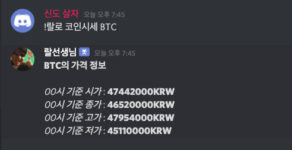

## 비트코인 시세 가져오는 방법

비트코인 시세를 알아보기 가장 쉬운 방법은 [bithumb api](https://apidocs.bithumb.com/)를 사용하는 것이다. 매우 간단한 요청으로 비트코인 시세를 가져올 수 있다.

[Ticker](https://apidocs.bithumb.com/docs/ticker) 라는 api를 이용하면 되는데, 빗썸 거래소의 가상화폐 현재가를 제공하는 api이다.

``` 
// 요청 예시

https://api.bithumb.com/public/ticker/ETH_KRW

{"status":"0000","data":{"opening_price":"1438000","closing_price":"1410000","min_price":"1338000","max_price":"1445000","units_traded":"154148.01533447","acc_trade_value":"214913727611.3714","prev_closing_price":"1438000","units_traded_24H":"215382.76816575","acc_trade_value_24H":"302541966044.2088","fluctate_24H":"-15000","fluctate_rate_24H":"-1.05","date":"1610188651008"}}
```

## 구현

```javascript
// commands/crypto_curr.js
const http = require('request-promise')
require('dotenv').config();

const options = (coinName) => {
  return {
    url: `https://api.bithumb.com/public/ticker/${coinName}_KRW`,
    method: 'GET'
  }
};

module.exports = {
	name: '코인시세',
	description: '비트코인 시세',
	async execute(msg, args) {
    if (args.length < 3) {
      msg.channel.send('코인의 이름을 입력해주세요. ex) `!랄로 코인시세 BTC`');
      return;
    }

    try {
      const result = await http.get(options(args[2]));
      const resultJson = JSON.parse(result);

      messageBody = `**${args[2]}의 가격 정보**\n\n`

      messageBody += `*00시 기준 시가* : **${resultJson.data.opening_price} KRW**\n`
      messageBody += `*00시 기준 종가* : **${resultJson.data.closing_price} KRW**\n`
      messageBody += `*00시 기준 고가* : **${resultJson.data.max_price} KRW**\n`
      messageBody += `*00시 기준 저가* : **${resultJson.data.min_price} KRW**\n`
      msg.channel.send(messageBody);
    } catch (e) {
      console.log(e);
    }
  },
};
```

위처럼 간단하게 API를 call한 뒤에 응답을 JSON으로 parse하여 채널에 다시 보내는 코드를 작성했다



youtube api에 비해 훨씬 간단하고 복잡한 과정 필요없이 open된 api라 사용하기 쉬웠다.